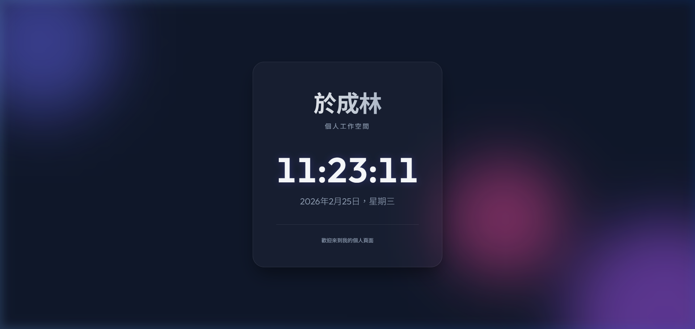

# Yu Chenglin Personal Page

A premium personal workspace page featuring a modern glassmorphism design and dynamic real-time elements.

## ✨ Features
- **Glassmorphism Design**: Sleek, semi-transparent interface with advanced blur effects.
- **Dynamic Background**: Animated atmospheric blobs that create a living background.
- **Real-time Clock**: A precise digital clock that updates every second.
- **Auto Date**: Automatically displays the current date in a sophisticated format.
- **Fully Responsive**: Optimized for seamless viewing on desktops, tablets, and mobile devices.

## 🛠️ Tech Stack
- **HTML5**: Structured semantic markup.
- **CSS3**: Advanced layouts, gradients, and custom animations.
- **JavaScript**: Lightweight logic for real-time updates.
- **Typography**: Premium font pairing using Google Fonts (Playfair Display & Outfit).

## 📸 Preview

---
*Created and deployed with the assistance of Antigravity AI.* 

